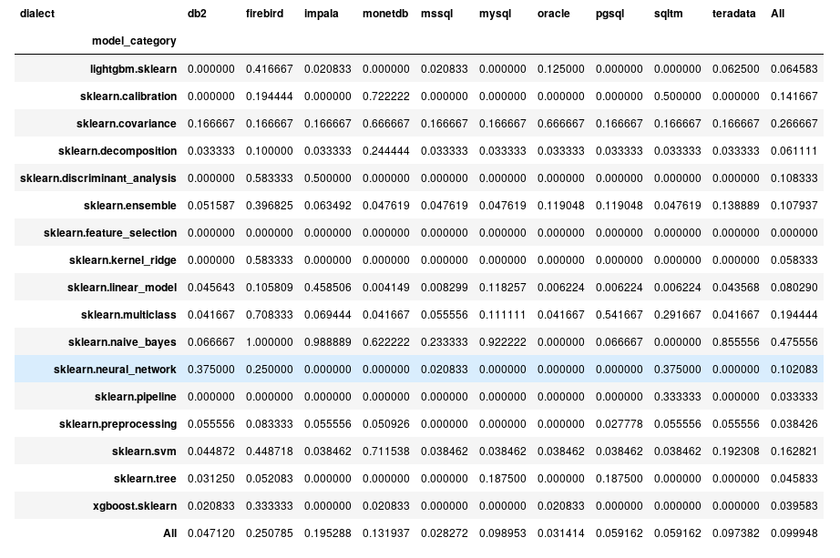

# sklearn2sql_heroku


[](https://travis-ci.org/antoinecarme/sklearn2sql_heroku)

This is a Heroku web service client for experimenting with sklearn2sql.

sklearn2sql is an ongoing development tool for generating deployment SQL code from [scikit-learn](http://scikit-learn.org/) objects.

For this web service, the user provides a pickled scikit-learn model and gets a JSON containing the SQL code for deploying the model.

**This web service is provided for demonstration purposes. Please don't use it with sensitive data.**

Early adopters feedback , improvement requests, hints and github issues are welcome.

# Demo

```Python
import pickle, json, requests, base64
from sklearn import datasets 
from sklearn.ensemble import *

# get a dataset 
iris = datasets.load_iris()# or whatever dataset
# train a model on the dataset
clf = RandomForestClassifier(n_estimators=12, random_state = 1960).fit(iris.data, iris.target)

# stringify the model
b64_data = base64.b64encode(pickle.dumps(clf)).decode('utf-8')
# send the model th the web service
json_data={"Name":"model1", "PickleData":b64_data , "SQLDialect":"oracle"}
r = requests.post("https://sklearn2sql.herokuapp.com/model", json=json_data)
content = r.json()
lSQL = content["model"]["SQLGenrationResult"][0]["SQL"]
print(lSQL);
```

The script [test_client.py](test_client.py) is a sample usage for this web service (running on `https://sklearn2sql.herokuapp.com/`). 

More sample scripts are available in the [tests](tests) directory (WIP).

There is also a [Jupyter notebook](docs/WebService-MLP_Deploy.ipynb) demoing the service by executing the SQL code and comparing the deployment results.

# About sklearn2sql

Using sklearn2sql, it is possible to predict values from an already-fitted classifier or a regressor simply by executing some SQL code. It can be seen as an alternative to PMML-based methods to perform [In-database processing](https://en.wikipedia.org/wiki/In-database_processing).

The SQL code is produced in an agnostic way (the mechansim used does not depend on the database) and supports most widely used relational databases (`["db2", "hive", "mssql", "mysql", "oracle", "postgresql", "sqlite"]`). 

It is designed to support all [classification and regression methods in scikit-learn](http://scikit-learn.org/stable/modules/classes.html) (SVMs, linear models, naive-bayes. decision trees, MLP, etc) , as well as transformations (PCA, imputers, scalers), feature selection, outlier detection and  and their derived objects (random forest, meta-estimators, pipelines, feature unions, ensembles,  etc). 

Roughly speaking, sklearn2sql allows one to translate a scikit learn model as a large, machine-friendly ;) SQL code that can later be executed on your favorite database.  For example, this is a [multilayer perceptron on oracle](https://github.com/antoinecarme/sklearn2sql-demo/blob/master/sample_outputs_round_8/MLPClassifier/BreastCancer/oracle/demo2_MLPClassifier_oracle.sql) , and this is a [random forest on postgresql](https://github.com/antoinecarme/sklearn2sql-demo/blob/master/sample_outputs_round_8/RandomForestClassifier/FourClass_100/pgsql/demo2_RandomForestClassifier_pgsql.sql) .... 


# SQL Design


For the SQL code design, the author tried when possible to use meaningful aliases in the SQL code. The names are intention revealing according to the excellent [Modern SQL](http://modern-sql.com/use-case/literate-sql). For example, a [SQL generated from a decision tree](https://github.com/antoinecarme/sklearn2sql-demo/blob/master/sample_outputs_tuning_round_1/DecisionTreeClassifier/iris/pgsql/demo2_DecisionTreeClassifier_pgsql.sql) contains three common table expressions (CTEs) whose names are : "DT_node_lookup", "DT_node_data" and "DT_Output. 

This design has  a significant impact on the performance. All SQL codes are tested to execute in less than 2-3 minutes on the various databases.

# SQL Generation Quality 

We performed a set of benchmarks. We trained each supported model on a set of datasets (provided with sklearn), and generated the code for each database, compared the generated result with the python result.

The following figure gives **the error rate of the system** (as of 2018-04-09) for each database and each group of models. For instance, the group 'sklearn.ensemble' stands for all ensemble methods tests (AdaBoost, Bagging, GradientBoosting, RandomForest, ExtraTrees, etc).




The detailed result of the quality tests is available in this [jupyter notebook](Quality/extensive_tests-debrief.ipynb) and will updated when needed. Last update : [changes](https://github.com/antoinecarme/sklearn2sql_heroku/commit/0d31e6d60aed63de38455cf3db03aa48252d6620#diff-afe4f3ba8d4cc68b5003ab9a4c0ac616)
